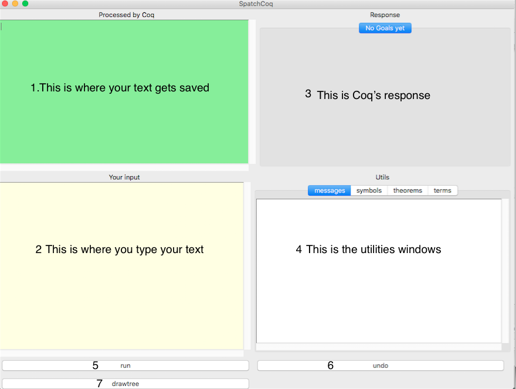

markdown_extensions:
    - admonition	
#Section
This is our first section.

Another paragraph.

We can use Markdown for figures.



!!! note

         This is a note.

[I'm an inline-style link](https://www.google.com)

[I'm an inline-style link with title](https://www.google.com "Google's Homepage")

[I'm a reference-style link][Arbitrary case-insensitive reference text]

[I'm a relative reference to a repository file](../blob/master/LICENSE)

[You can use numbers for reference-style link definitions][1]

Or leave it empty and use the [link text itself].

```URLs and URLs in angle brackets will automatically get turned into links. 
http://www.example.com or <http://www.example.com> and sometimes 
example.com (but not on Github, for example).```

```python
s = "Python syntax highlighting"
print s
```


Some text to show that the reference links can follow later.

[arbitrary case-insensitive reference text]: https://www.mozilla.org
[1]: http://slashdot.org
[link text itself]: http://www.reddit.com

Markdown for lists
---

* One
* Two
    * Nested one
        * nested 3
* Three
    1. Numerated list
    1. No need to specify number

**NOTE**

It works with almost all markdown flavours (the below blank line matters).

---

We can even inline math: $y = ax + b$.  


----------------------- ------------------------------------
\ Table multiline text bla bla bla bla
                        bla bla bla bla bla bla bla ... the
                        blank line below is important 

----------------------------------------------------------------


How about displayed equations:

$$
y = -2.2x + 0.5
$$

## Subsection
Just use Markdown to define sections and structure of the document.

Let's finish with a footnote.[^1]

[^1]: I'm a footnote!